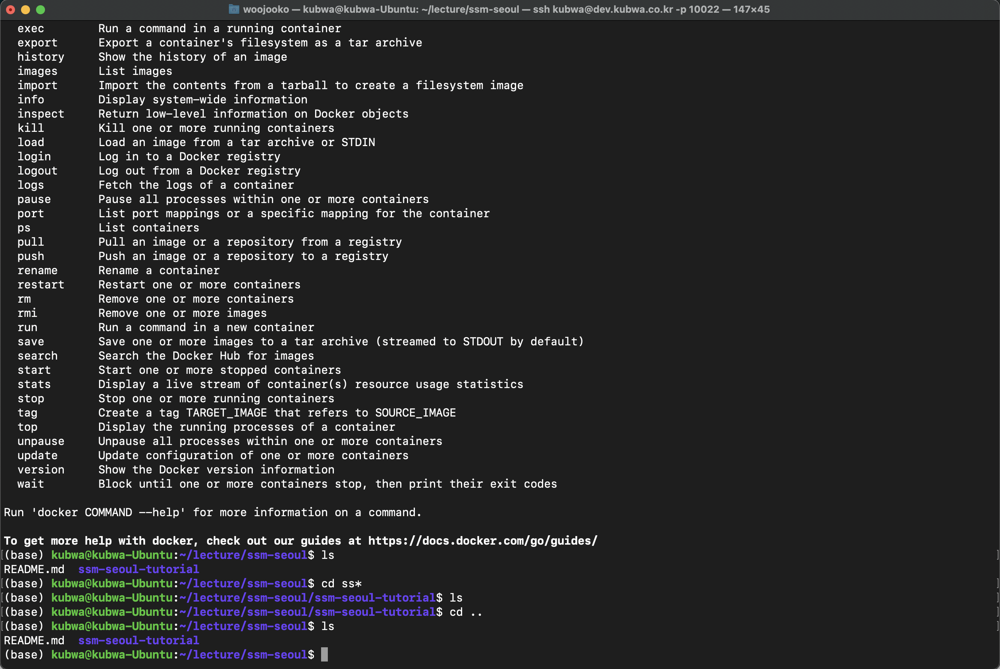

# ssm-seoul-data-engineer

# Practical Issues in Data Engineering 1주차 요약 
## 1. Data Engineering
- 데이터 과학자가 사 용할 수 있는 형태로 만드는 것에 대한 공학 분야
- 최근의 개념은 다양한 오픈소스의 조합을 통해서 데이터 ETL 작업과 파이프라인을 구성

## 2. Hadoop Ecosystem & Devops
### Hadoop 1.x: MapReduce
`Hadoop MapReduce Framework`: 분산 환경에서의 병렬 데이터 처리 기법, 프로그래밍 모델
### Hadoop 2.0: HDFS, YARN
 - High Availability NameNode
 - Multiple Namenodes

`HDFS(Hadoop Distributed File System)`: 하둡 분산파일 시스템
1. 하둡 분산 파일 시스템은 대용량 데이터를 저장하고 처리하기 위해 고안된 분산 파일 시스템
1. 한 번 쓰고 많이 읽혀지는 사용 패턴이 적합하며, 비교적 값싼 하드웨어 다수의 (수십 수백 대 이상) 노드 사용
1. 노드를 추가하는 것 만으로 선형적으로 Throughput 및 저장공간의 확보가 가능
1. 파일 블록(128mb)을 읽기 때문에 작은 용량 혹은 Latency 가 중요한 시스템 보다는 대용량 데이터 처리에 최적화 되어 있는 시스템 5. 모든 파일 정보를 메모리에 올려두고 관리되어 많은 파일을 관리해야 하는 경우는 적합하지 않습니다.
(1 block = 150bytes * 100만 = 300mb, 1억 = 30gb)
1. 임의의 파일 수정은 어려우며, 다시 생성하고 삭제하는 방식이 효과적
(Append 기능이 2.1.x 이상에서 가능)

 - Write Files on HDFS
 - Read Files on HDFS

`YARN(Yet Another Resource Negotiator)`: 하둡 분산처리 시스템

1. 각 노드에는 저장되어 있는 파일 블록 들이 최 대한 균등하게 저장되어 있습니다
1. 임의의 데이터 소스를 지정하면 지정된 파일 블록을 각 노드에서 map task 프로세스가 실행되 어 처리합니다 (병렬 처리)
1. 처리 완료된 데이터는 reduce 단계로 저장된 중간 혹은 최종 노드의 로컬 임시 파일에 정렬되 어 순차적으로 저장됩니다 (순차 처리)
1. 모든 reduce 작업이 완료되면 새로운 단계로 진행될 수도 다시 map-reduce 과정이 반복되기 도 합니다

### 하둡에코시스템 현황
- In-Memory Computing
- High Availability
- Scalability w/ HDFS Federation
- Scalability w/ YARN Router-based Federation

### Hadoop 3.0
1. `Erasure Coding`: Support for Erasure Coding in HDFS
1. `Erasure Coding`: Write, Read Performance Benchmark
1. `Erasure Coding`: TeraSort, WordCount Benchmark
1. `Yarn Timeline Service`: Yarn Timeline Service v2
1. `Shell Script Rewrite`: Rewrite Shell Scripts
1. `Shaded Client Jars`: Shaded Client Jars
1. `Opportunistic Containers`: Support for Opportunistic Containers and Distributed Scheduling
1. `Native Optimization`: MapReduce task-level native optimization
1. `Multi NameNodes`: Support for more than 2 NameNodes
1. `Default ports changed`: Default ports multiple service have been changed
1. `Datanode Balancer`: Intra-datanode balancer
1. `Heap Management`: Reworked daemon and task heap management

## 3. 하둡 에코 시스템 도구
1. 관계형 데이터베이스 수집을 위한 도구
> Database Client, Embulk, Sqoop, Spark JDBC Connector
2. 스트림 데이터 혹은 파일수집을 위한 도구
> Scribe, Flume, Logstash, Fluentd

|속성 | Fluntd| Logstash| Flume| Scribe |
|---|---|---|---|---|
|설치|gem/rpm/deb|tar/rpm/deb|jar/rpm/deb|make|
|코드| ruby 3000 lines  |java|java - 50,000 lines|C++ 8,000 lines|
|플러그인|ruby|ruby|java|n/a|
|플러그인 배포| rubygems.org|urbygems.org|n/a|n/a|
|마스터 구조|n/a|n/a|n/a|n/a|

3. 데이터 변환을 위한 도구
> MapReduce, Cascading, Pig Latin, Hive, Spark
4. 데이터 적재 및 서비스를 위한 도구
> Hive, Impala, HBase, Kudu, MongoDB, Kafka